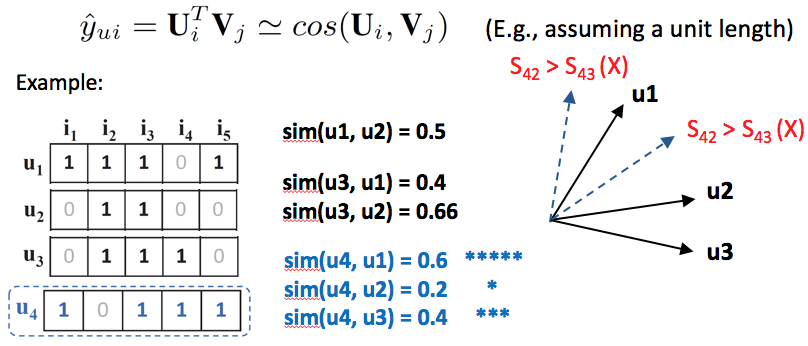
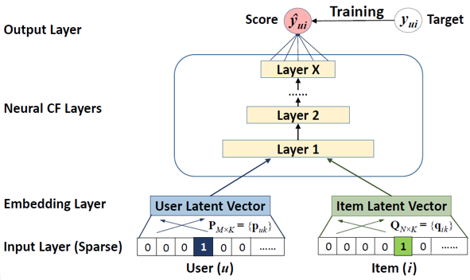
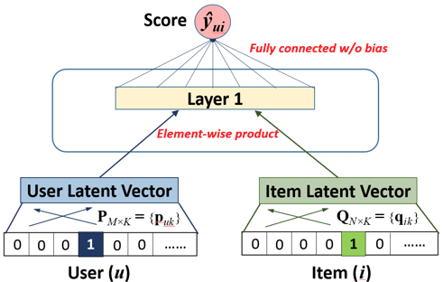
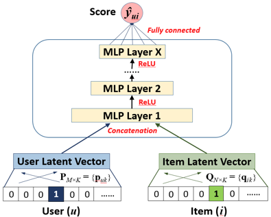
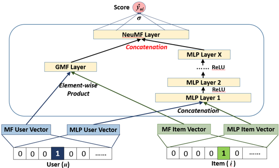

* Neural Collaborative Filtering(WWW 2017) 의 요약문
* https://arxiv.org/abs/1708.05031

## Intro
* 일반적인 matrix factorization 방식에 문제 제기하고 이를 풀어갈 방법론을 제안한 형태의 논문이다
* MF의 일반적 방식?
    * User 와 item 을 더 낮은 차원의 latent vector 로 나타내고, user 와 item 간의 interaction 을 이 latent vector 의 inner product가 될 수 있도록 만들게 된다.

### 문제제기
* inner product 기반의 matrix factorization 은 ranking loss 를 야기할 수 밖에 없음
    * 아래는 내적 기반 factorization 에서 ranking loss 가 발생하는 예
    
* deep learning 연구 동향에 문제제기
    * 연구 주제가 side information (text, image, audio 등,,, side...??) 에 집중되어 있음
* 그래서 이 논문에서는 deep learning 을 이용하여 내적을 사용하지 않는 대신 interaction function 자체를 data로부터 learning 시키는 형태를 취하는 방식을 제안함!

## Methodology

* Neural Collaborative filtering Framework 는 세가지 단계로 구성된다.
    1. GMF (Generalized matrix factorization)
        * matrix factorization 의 형태를 generalize 시킨 것
        * 내적 대신 element-wise product 를 이용한다.
        
    2. MLP (Multi-layer perceptron)
        * MLP layer 만 통과시키면서 Interaction function non-linearity 를 학습시키는 과정
        
    3. NeuMF (Neural Matrix Factorization)
        * GMF 와 MLP 를 앙상블 시킨 형태
        

### General Framework 
* Input layer
    * User 에 대한 latent vector / item 에 대한 latent vector
	* One hot encoding
    * 이 벡터 안에 뭘 넣어도 상관 없음
        * (categorical data 든 뭐든 다 때려넣어서 만들 수 있음)
	    * 논문에는 pure 하게 하기 위해서(다른 방식과의 비교 등?) user, item 의 identity 로만 했다고 되어있음
* Embedding layer : fully connected layer / sparse representation 을 dense 하게만든다.
* Last layer X : 최종 score y_ui [0, 1]
	* target value y와의 pointwise loss 를 minimize 시키는 방식으로 training
    (observed interaction – unobserved interactions 은 negative instance 로 간주한다)
* loss function : binary cross entropy function
* Negative instance
    * unobserved interaction 중에서 uniformly sample 함(observed interaction 수에 비례하게 추출)
* Cold start 를 막기 위해서 이 논문에서는 user, item 을 표현한 content feature 들을 썼다
    - (더불어 further improvement 로 item popularity bias를 넣어서 sampling 을 할 수도 있을 것 같다고 설명하고 있음)

### GMF
* 여러 extention 이 가능하겠지만 이 논문에서 실험을 할때에는 activation function 을 1 uniform vector 로 만들어서 MF model 형태를 그대로 씀
* (activation 에 non-linearity 를 줄 수도 있지만 그건 이 프레임워크의 extention 가능성 중 하나인 걸로 두고자 했다고 한다)

### MLP
* user vector 와 item vector 를 그대로 concat 시킨 후 mlp layer 를 통과시키는 형태
* interaction function 자체를 학습 시키기 위해서 이때는 non-linear kernel 을 썼다고 한다.

### NeuMF
* Fusion of GMF and MLP
* GMF와 MLP 의 두 모델에서의 embedding layer 의 결과는 매우 다를 수 있기 때문에 각 모델을 수직으로 쌓아올리는건 성능 향상에 전혀 기여하지 못한다.
* 그렇기 때문에 input layer 만 서로 공유한 후, embedding 도 따로 하며, 마지막 hidden layer 에서야 concatenate 하는 병렬적 형태로 구현하게 된다.
* pretraining
    * GMF 와 MLP 의 모델을 따로 pretraining 시킨 후 사용하는게, converge 속도도 빠르고 해서 좋다고 한다.

