* Understanding Behaviors that lead to purchasing - a case study of PInterest(KDD 2016) 의 요약문
* https://dl.acm.org/citation.cfm?id=2939729

## 요약
### insight
* 유저의 관심 자체가 아닌 구매 징후를 보고자 한다면, category 에 해당하는 전체 action 의 수를 세는 것 보다는 domain 별 action 으로 세분화 하여 보는게 좋다
    * purchaser 의 action과 activity count 를 보면 절대 non-purchaser 에 비해 더 많지 않다.
    * purchaser 와 non-purchaser 는 action 을 raw level 로 세분화 하면 action 별로 활동 비율에 차이가 생긴다.
* 구매 예측은 짧은 시간 단위의 행동로그를 feature 로 이용할 경우 더욱 정확할 수 있다.
    * purchaser 의 카테고리 집중도는 구매 전 약 1달 간 항상 non purchaser 보다 높지만, 구매 10일전, 특히 3일 전 폭증하는 경향이 있다.
* 유저가 갑작스러운 결정으로 구매할 수 있는 상품인지, 장고끝에 구매가 가능한 상품인지에 따라 구매 징후로서 수집하는 로그의 길이나, 로그의 성격이 달라야할 수도 있다.
    * 구매 대상의 카테고리별로 짧은 시간 내에 유저의 카테고리 집중도가 늘어나는 정도가 다르다 / 구매 징후가 카테고리별로 다르게 나타날 수 있다.

### Intro
* 유저의 activity 와 구매 행동에 대한 case study
    * 구매행동까지 이어지는 유저의 activity 를 시간단위로 분석
    * (time-varying user purchasing intent 예측 모델 개발을 위한 사전 연구 역할을 수행하고자 함)
* Cross-platform purchasing behavior 분석
    * Pinterest data 와 pinterest의 파트너사의 구매로그를 이용
    * (첨언) Pinterest 서비스
        * instagram 의 사진 수집용 버전 sns라고 볼 수 있음
        * 구매 플랫폼이 될 수는 없으나 content discovery platform 은 될 수 있음
    * 구매 플랫폼이 아닌 타 플랫폼에서 나타나는 구매징후를 분석
* 분석한 결과를 토대로 feature 를 선택하여 간단한 모델링 및 실험

## User Activity Characteristics
* purchaser 의 구매전 28일치 데이터, non purchaser 의 28일치 데이터에서 pinterest 활동 일 수와 활동 action 수 비교
    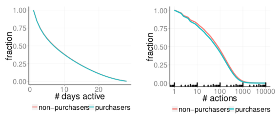
    * 활동 일수 자체는 두 그룹에서 차이가 없음
    * action 수는 오히려 non-purchaser 가 더 많음
* → **더 세분화 된 그림에서 봐야 purchaser 와 non-purchaser 의 활동에서 차이가 있을 것**

## Dynamics of Purchase Intent
### 1. User Activity level
#### 1-1. Purchaser 의 action 은 weekly cycle 을 가진다
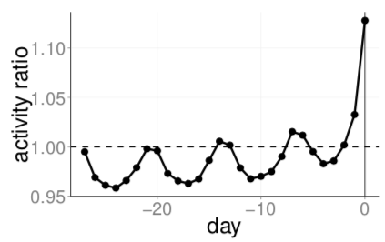
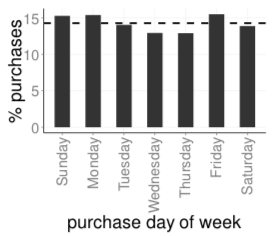
* activity ratio : 특정 날짜에 non-purchaser 대비 purchaser 의 active 비율
* 구매 행위는 특정 요일에 몰리는 경향이 있다.(금, 일, 월)
* purchaser 는 구매 발생과 동일한 요일에 action 을 non-purchaser 에 비해서 더욱 많이 활동한다.
* 나머지 요일엔 non-purchaser 보다 활동이 적은걸로 보아, 구매가 일어나는 요일에 더 많이 활동하고, 그렇지 않은 요일에 덜 활동하는 경향이 있다.

#### 1-2. Purchaser 의 activity는 구입일과 가까워질수록 증가한다
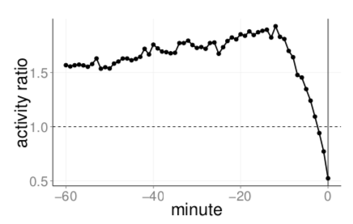
* 구매전 3일 전이 가장 분명함
* 구매 당일엔 다른날보다 20% 더 많이 활동함
* **→ 구매시기가 가까워질 수록 purchaser 들은 content discovery application 을 더욱 많이 사용하는 경향이 있다.**

### 2. Types of User Action
* AS(u, d, a) = user u 가 date d 에 다른 action 에 대비 action a 를 한 비율
* ASR(d, a)= non-purchaser 대비 purchaser 의 AS(u, d, a)
* action 은 clickthrough, close up, save, search 의 네가지로 선정
    * view 등 사용자가 의도적으로 하지 않은 행위는 제거
    * 이 중 clickthrough 와 save 가 상세 컨텐트에 더욱 engage된 action 이라고 볼 수 있을 것

#### 2-1. Long-term behavior
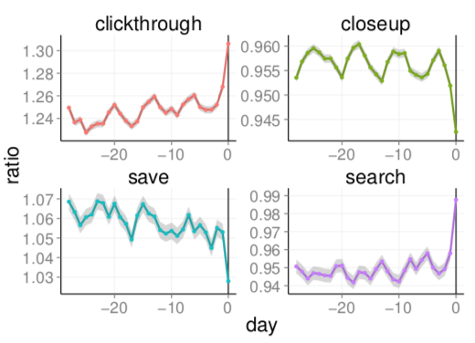
* purchaser 는 clickthrough, save 를 non-purchaser 에 비해 많이하고(항상 1보다 큼), close up, search action 은 보다 더 적게한다(항상 1보다 적음)
    * → purchser 는 specific content 에 더 집중하는 경향이 있음
* clickthrough 를 save action 보다 더 많이 함
    * → clickthrough 를 더 강한 구매 징후라고 볼 수 있을 것
* purchaser 의 action 은 non-purchaser 에 비해 시간에 따라 큰 변화를 보인다
    * purchaser 의 clickthrough action 은 구매 3일 전 매우 크게 증가함 / 반면 non-purchaser 의 clickthrough 는 constant 에 가까웠다(그래프에선 보여지지 않음)
    * 위와같은 시간에 따라 변화하는 경향은 다른 action 에 대해서도 마찬가지
    * → purchaser 의 행동은 구입 이전까지 변한다.

#### 2-2. Short-term behavior
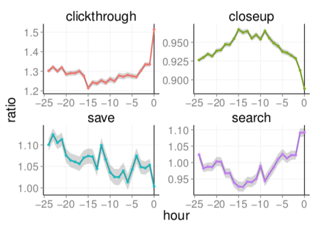
* day0 에서 clickthrough, search 가 급격하게 증가함
* action 총합은 구매가 일어나기 8~15시간 전에 가장 많았다
* short-term 에서 가장 특징적 action 이라 볼 수 있는건 search 일 것
    * long-term 에선 purchaser 가 더 낮게 search 한 반면, short-term 에선 구매 시간에 가까워질 수록 많아짐
    * → 구입 당일에는 구입 직전까지 content 에 대한 browsing 을 많이 한다.

### 3. Content Users Interact With
* 구입 직전까지 행동이 계속 바뀐다면, 그 행동의 대상은 무엇인가
* Pinterest 에서 정의하는 32개 content category 로 interact 하는 대상을 정의
* Category Interaction Score : I(u, d, c)= user u 가 date d 에 category c 에 해당하는 action 을 다른 category 에 비해 얼마나 많이 하는지
* Purchase Category Focus : PCF(p, d, c) = I(p, d, c)/avg(I(u, d, c) for non-purchaser)
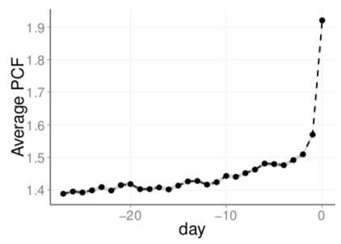
* Average PCF
    * 항상 PCF 가 1보다 큼 → 구매 28일전부터 이미 purchaser 는 구매할 상품의 카테고리에 집중함
    * 구매일에 가까워질수록 PCF 가 꾸준히 증가함
    * 구매 3일 전부터 PCF 가 급격히 증가함

#### Per-category PCF
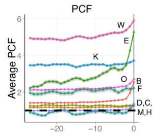
* 대부분의 category 에서 PCF 는 1을 넘는다
* PCF level 은 category 별로 크게 다르기때문에, user 가 해당 상품에 얼마나 끌렸는지 보려면, 카테고리별로 measure 해석을 달리해야한다
* 구매시점까지 변화가 큰 카테고리(E : holidays & events) 가 있는가하면 변화가 크지 않은 카테고리(C : diy & crafts)도 있다
    * 유저가 갑작스러운 결정으로 구매할 수 있는 상품인지에 따라서 이 경향이 달라질 수 있을거라 설명함
    * (diy 등은 단시간내에 결심할 수 없는 일이기때문에)

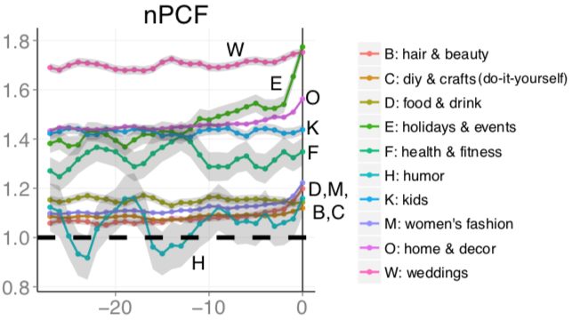
* nPCF : nPCF(p, d, c) = I(p, d, c) / avg( I(non-purchaser with interest, d, c)
    * non-purchaser with interest : date d 에 category c 와 interaction 이 있었던 non-purchaser 들
    * 원래 해당 카테고리에 관심이 있던 다른 non-purchaser 와 purchaser 를 비교하기 위함
* 모든 카테고리에서 원래 해당 카테고리에 관심이 있던 non-purchaser 보다, purchaser 가 더 해당 카테고리에 focus 하는 경향을 보임 (모든 카테고리에서 nPCF 가 1보다 큼)

## Modeling
* Purchasing intent 를 잡아내는데에, 시간별 행동정보, interaction content 의 정보가 유용할 수 있는지를 간단한 모델링 테스트로 증명

### Features
* Demographics (4 features)
    1. 성별
* 지역정보
    1. board 의 갯수
    2. 유저가 pin 한 횟수
* Activity (2 features)
    1. 이전 7일 중 접속한 날의 수
    2. 하루동안 유저의 action 수
* Action type (2 features)
    1. 네가지 action 의 비율 (clickthrough, search, close up, save)
    2. platform usage information (e.g., mobile, desktop)
* Content (2 features)
    1. category interaction score (위에서 I(u, d, c)
    2. pinterest 내부적으로 분류하고 있는 500 LDA-trained topics (유저의 action 레벨에 따라서 normalize 시킴)
* Temporal (3 features)
    * earlier feature value 와 given time 에서의 feature value
    * action-type, content feature
    1. 1주전
    2. 3일전
    3. 6시간

### 1. Modeling Purchasing Intent Over Time
* purchaser, non-purchaser classification model (Logistic regression 이용)
* 활용한 날짜별로 모델의 성능이 어떻게 달라지는지 확인
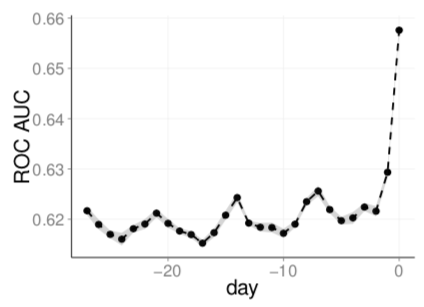
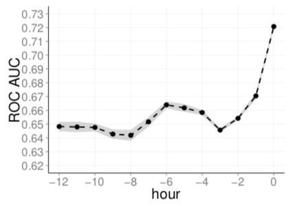
* 요일별로 활동량이 달라서, ROC AUC score 도 요일별로 차이가 있음
* random (0.5)보다는 항상 score 가 높음
* 구입일에 가까울수록 score 상승하는 경향이 있으며, 구입 3일전부터 크게 상승함
* 구입 시간에 가까울수록 score 높음

### 2. Importance of Different Signals
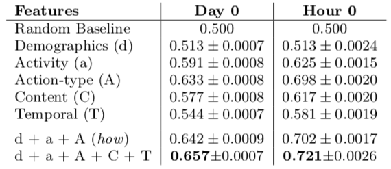
* what에 해당하는 feature(content category) 보다는 how  에 해당하는 feature(activity, demographics, action-type) 가 더 효과가 좋다.

### 3. Modeling Per-Category Purchase Intent
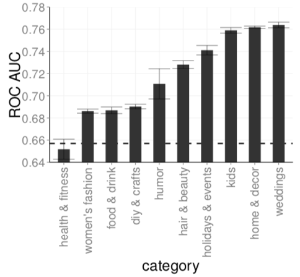
* day based 예측(1. Modeling Purchasing Intent Over Time)보다는 훨씬 예측력이 높다
* (점선 : 카테고리 상관 없이 purchaser 인지 구분할 때의 score)
* 해당 카테고리의 상품을 구입할 것인지를 예측 → 대부분의 카테고리에서 category-based classification 이 general purchaser classification 보다 효과적
* 유저의 구매 결정에 대한 insight 에 유저가 본 컨텐츠 정보는 큰 영향을 준다.
    * 카테고리별로 PCF 가 다른 양상을 보였음 (3. Content Users Interact With)
    * PCF와 AUC ROC score 의 spearman rank correlation coefficient 가 0.75 → 강한 양의 상관관계
* 시간 별 feature, content 정보는 구매 예측 모델에 효과적인 feature 임